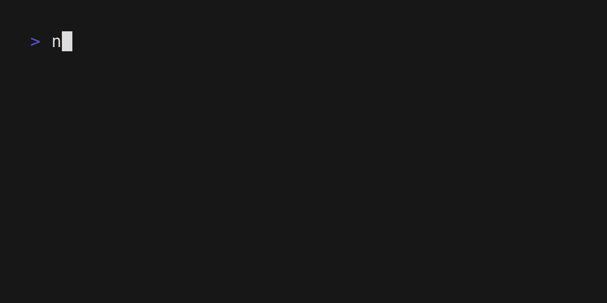

# ❄️ 42-nix

Development enviroment for École 42 Common Core projects using Nix Flakes.

> **Warning**
>
> This flake is a WIP. Expect breaking changes.

## 🎯 Goal

The goal of this project is to provide a reproducible environment for École 42 Projects using Nix flakes.

## 🐚 Dev Shell

The flake consists of a development shell that provides the following packages:

- [`bear`](https://github.com/rizsotto/Bear): useful for generating `compile_commands.json` for clang tools.
- `clang-tools_12`: provides `clangd` language server.
- [`gnumake`](https://www.gnu.org/software/make/)
- `llvmPackages_12.libcxxClang`: C language family frontend for LLVM 12.
- [`valgrind`](https://valgrind.org/): debugger and profiler for Linux executables.
- [`norminette`](https://github.com/42School/norminette)
