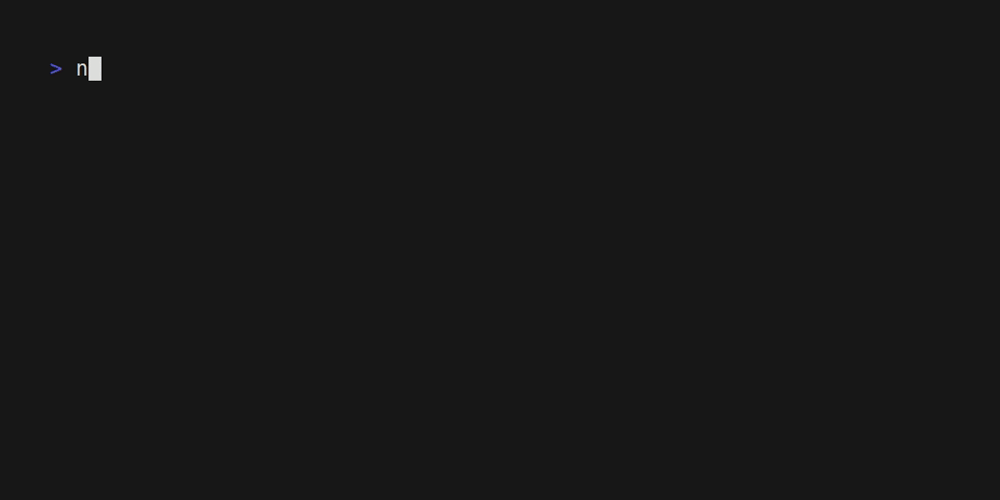

# ❄️ 42-nix



This project provides development environments for 42 School Common Core projects using Nix Flakes. It provides Nix Flakes templates to create development enviroments for your projects, while providing packages and overlays for usage in other flakes.

> **Warning**
>
> This flake is a work in progress and may undergo breaking changes.

## ⭐ Features

### Project templates

This flake includes nix flake templates for the 42 School projects.

There are 2 templates:

- `minimal`: Provides GNU Make, Clang 12, LibCXX and norminette.
- `standard` (default): Provides all tools from the `minimal` template, alongside some extra tools, such as: bear, Clang 12 tools and valgrind.

#### Usage

You can use the `nix init` command to initialize a new project:

```sh
$ git init cpp-00
$ cd cpp-00
$ nix init -t github:vinicius507/42-nix#minimal
$ nix develop # Initializes a Nix Develop shell with the packages provided by the minimal template.
```

### 42 School Packages

This flake also provides the following 42 School related packages:

- [`norminette`](https://github.com/42School/norminette): 42 School C linter.

#### Usage

You can run the norminette directly using `nix run`:

```sh
$ nix run github:vinicius507/42-nix#norminette -- --version
norminette 3.3.51
```

Or add them to your NixOS/Home Manager configuration:

```nix
{
  inputs = {
    nixpkgs.url = "nixpkgs";
    ft-nix = {
      url = "github:vinicius507/42-nix";
      inputs.nixpkgs.follows = "nixpkgs";
    };
  };
  outputs = {self, nixpkgs, ft-nix, ...}:
  let
    system = "x86_64-linux";
    # [...]
  in
  {
    nixosConfigurations = {
      myriad = nixpkgs.lib.nixosSystem {
        modules = [
          { environment.systemPackages = [ ft-nix.packages.${system}.norminette ]; }
        ];
      };
    };
    # [...]
  };
}
```

You can also use the packages overlays to add them to your configuration:

```nix
{
  inputs = {
    nixpkgs.url = "nixpkgs";
    ft-nix = {
      url = "github:vinicius507/42-nix";
      inputs.nixpkgs.follows = "nixpkgs";
    };
  };
  outputs = {self, nixpkgs, ft-nix, ...}:
  let
    system = "x86_64-linux";
    pkgs = import nixpkgs {
      inherit system;
      overlays = [
        ft-nix.overlays.norminette
        # [...]
      ];
    };
    # [...]
  in
  {
    nixosConfigurations = {
      myriad = nixpkgs.lib.nixosSystem {
        modules = [
          { environment.systemPackages = [ pkgs.norminette ]; }
          # [...]
        ];
      };
    };
    # [...]
  };
}
```
